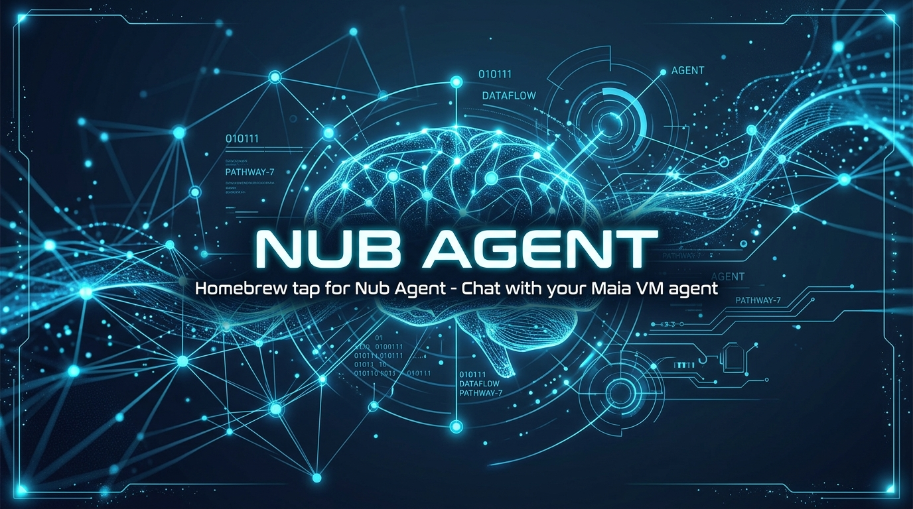

<p align="center">
  
</p>

# homebrew-nub-agent

Homebrew tap for **Nub Agent** — Chat with your Maia VM agent.

## Installation

```bash
brew tap DevvGwardo/nub-agent
brew install --cask nub-agent
```

## Update

```bash
brew upgrade --cask nub-agent
```

## Info

- **Homepage:** [https://www.maiavm.com/](https://www.maiavm.com/)
- **Architecture:** Apple Silicon (ARM64 macOS)
